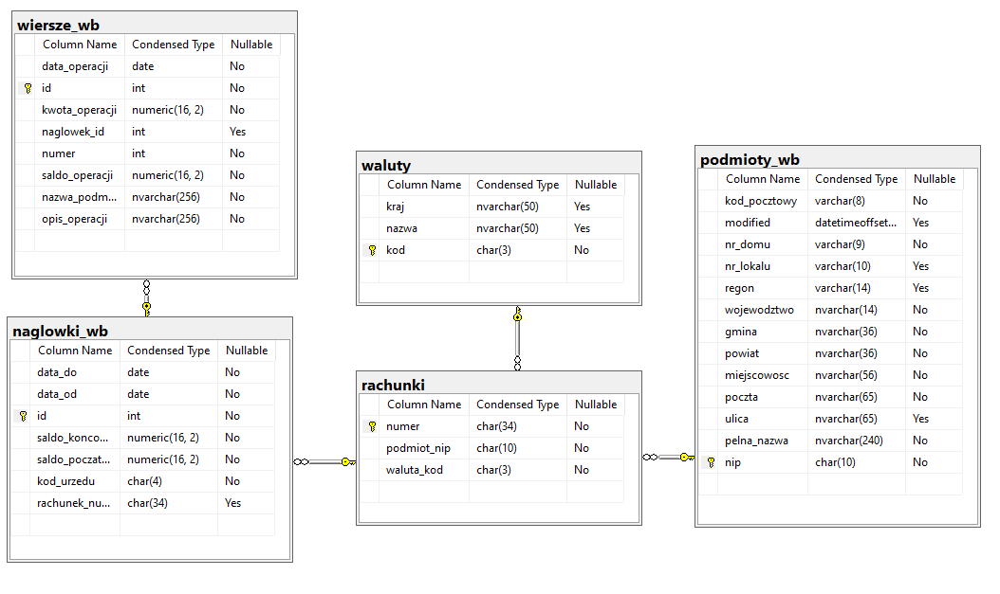
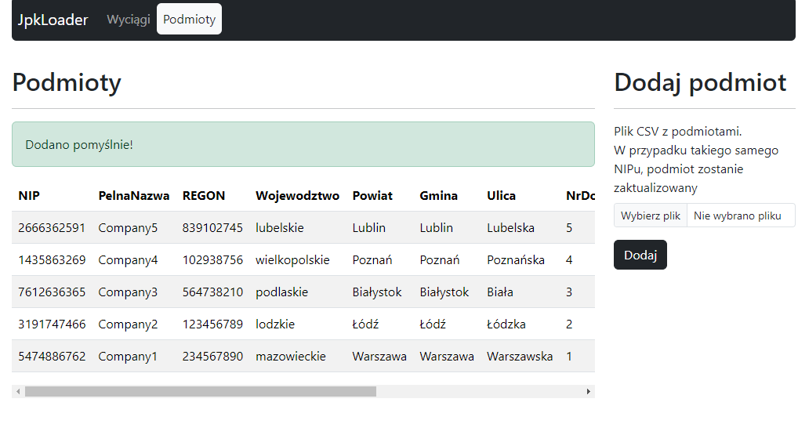
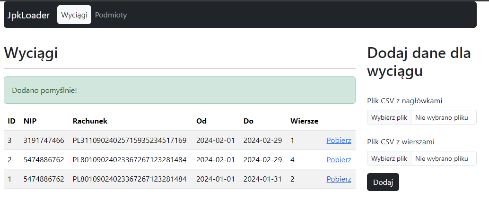
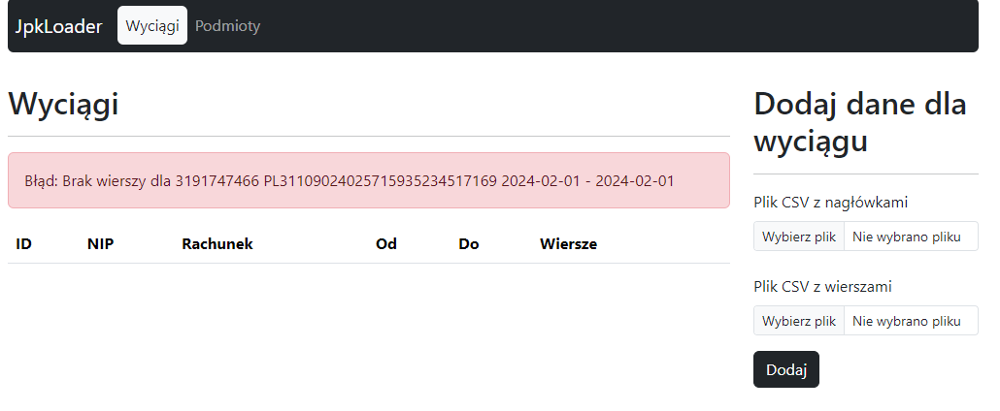
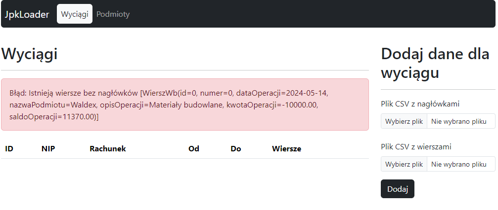
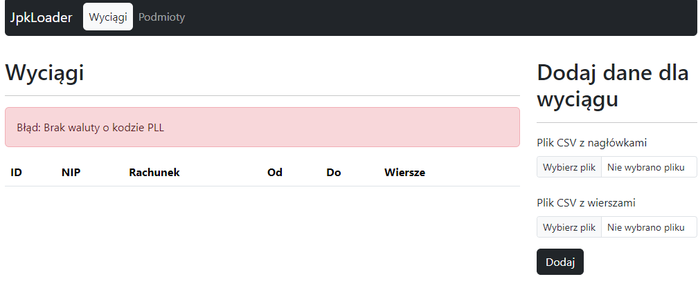
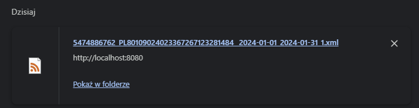

### JPK Loader - Project goal

The application facilitates the generation of bank statements in the government [JPK WB](https://www.gov.pl/web/kas/struktury-jpk) format. The application accepts three CSV files: a file with entity data, a file with data corresponding to statement lines, and a file containing additional data such as headers, account numbers, balances, and control sums. If the provided data is correct, the user receives a list of downloadable statements; otherwise, an error message is displayed. The statements are available for download in XML format, compliant with the ministerial schema for [JPK WB version 1-0](https://www.gov.pl/attachment/a533f872-6d51-41a1-b683-64a5e6f7fc19).

### Application architecture

The interface for uploading files is created in Java using the [Spring boot](https://spring.io/projects/spring-boot) framework along with the [Thymeleaf](https://www.thymeleaf.org/) library and [Boostrap](https://getbootstrap.com/docs/5.3/getting-started/introduction/), which is utilized to display a simple web application with a form for uploading files and displaying results. The application accepts source files in CSV format encoded in UTF-8, with data separated by tabs and accompanied by headers. Storage and partial data processing are managed by procedures and tables within an MS SQL (SQL Server 2019) database.

### Run application

```bash
./gradlew clean build
./gradlew bootRun
```

Sample CSV input files and XML output files can be found in [/example](/example/) folder.

Used JPK Schemas are available in [/src/main/resources/schema](/src/main/resources/schema)

### Fullfilled requirements

| Number | Requirement Description |
| ------ | ----------------------- |
| R01 | Output tables in the MSSQL database matching 100% the data format of the JPK WB output file (excluding constant attributes such as schema version) |
| R02 | Data is read from three CSV files with a specified structure (tab delimited) saved in UTF-8 encoding: 1. Entities, 2. Headers, 3. Rows |
| R03 | Ability to transfer multiple entities, headers, and rows simultaneously |
| R04 | Account dictionary built based on the submitted headers |
| R05 | Ability to update the entity dictionary by resubmitting the entity (identified by NIP number) |
| R06 | Verification of the semantic correctness of the input data according to the constraints imposed by the government schema (XSD): <br>1. Field lengths<br>2. Required fields<br>3. Number of occurrences <br>4. Compliance with dictionaries (currency codes)<br>5. Compliance with regular expressions defining a given type |
| R07 | Data consistency verification: <br>1. One account can only have one currency, all currencies defined in the file KodyKrajow_v4-1E.xsd are available.<br>2. Opening and closing balance defined in the header consistent with the balance in the first and last row for a given header. <br>3. Rows ordered to headers based on accounts and transaction date.<br>4. Each header must have at least one row<br>5. There cannot be rows without headers in the input data  |
| R08 | Input data must contain all necessary data to correctly generate the JPK extract (e.g., NIP, but REGON can be omitted) |
| R09 | Stored procedure in the MSSQL database processing data into the XML JPK WB file on user's request |
| R10 | Correct XML JPK WB 1-0 file as output, ready to be sent to the ministry gateway |
| R11 | Output file additionally validated using the government schema |
| R12 | All types of errors appropriately communicated to the user and recorded in the application log. |

### Data model



### Screenshots












